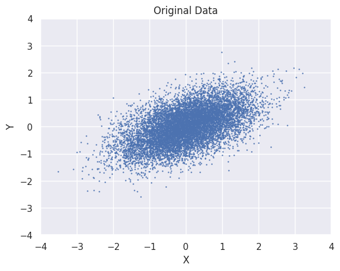
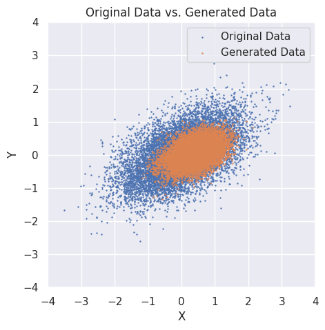
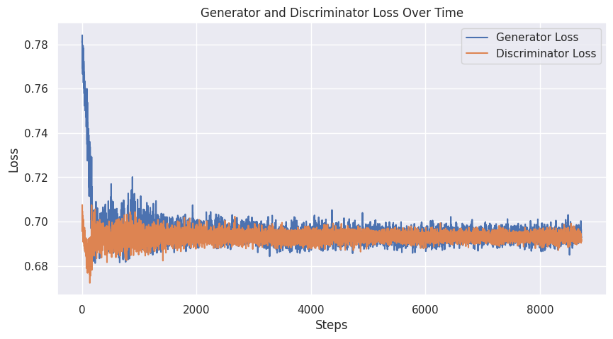

# GAN-2D-data
Approximating a 2D distribution (a subset of R^2) using a simple GAN

## Original Distribution
The original data distribution is a subset of R^2 (a skewed 2D Gaussian)

## Generated Using GAN
The model has figured out what the safe subset of R^2 is where the generator can fool the discriminator, without ever knowing how the original points where generated.
We can make the generated distribution (q) more similar to the real distribution (p) using various techniques (e.g. [Earth-Movers Loss](https://en.wikipedia.org/wiki/Earth_mover%27s_distance)) but that's not the point of this experiment. they are left for future more realistic projects.

## Loss History

